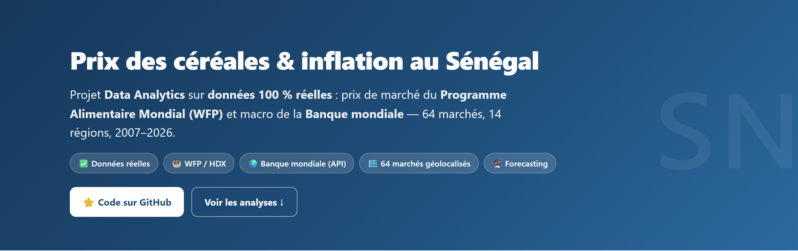
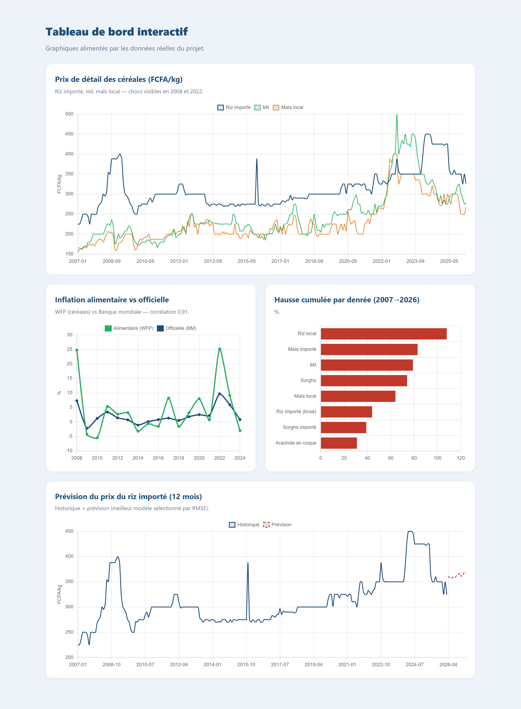

# 🇸🇳 Prix des céréales & inflation alimentaire au Sénégal (2007–2026)

> Projet **Business Intelligence / Data Analytics** sur **données 100 % réelles et
> officielles** : prix de marché du **Programme Alimentaire Mondial (WFP)** et
> indicateurs macroéconomiques de la **Banque mondiale**. Du téléchargement
> automatisé des données à la prévision, en passant par l'analyse SQL, la
> cartographie et un tableau de bord web.


### 🌍 [**Voir le site web du projet (démo en ligne)**](https://kheuch1492.github.io/senegal-food-prices/)

[](https://kheuch1492.github.io/senegal-food-prices/)

> *Tableau de bord interactif (graphiques alimentés par les données réelles) :*



---

## 🎯 Objectif

Analyser l'évolution des prix des **céréales et légumineuses de base** (riz, mil,
sorgho, maïs, niébé, arachide) au Sénégal à partir des **relevés réels de 64
marchés** sur **14 régions**, afin de :

- suivre l'évolution des prix de détail réels (FCFA/kg) ;
- mesurer l'**inflation alimentaire** et la comparer à l'**inflation officielle** ;
- identifier les chocs (crise de 2008, choc de 2022) et les denrées volatiles ;
- comparer les **disparités régionales** (carte des marchés) ;
- **prévoir** les prix à 12 mois.

---

## 📊 Résultats clés (données réelles)

| Indicateur | Résultat |
|---|---|
| Période couverte | **2007 → 2026**, 64 marchés, 14 régions |
| Crise alimentaire 2008 | **+25 %** d'inflation alimentaire (vs +7 % officielle) |
| Corrélation inflation alimentaire (WFP) ↔ officielle (BM) | **0,91** ✅ |
| Denrée la plus inflationniste | **Riz local +108 %**, maïs importé +83 %, mil +79 % |
| Indice du panier céréalier (base 100 = 2015) | **≈ 128** en 2026 |
| Meilleur modèle de prévision | **Régression (tendance + saison)** — MAPE **5,3 %** |


---

## ⚠️ Sources & transparence

- **WFP – Food Prices for Senegal** (via HDX) : relevés `actual`, *Retail*, en
  FCFA/kg. → [data.humdata.org/dataset/wfp-food-prices-for-senegal](https://data.humdata.org/dataset/wfp-food-prices-for-senegal)
- **Banque mondiale** (API v2) : inflation, IPC, PIB/hab., production alimentaire,
  population, chômage, pauvreté.
- **geoBoundaries** : contours des 14 régions.

Toutes les données sont **téléchargées automatiquement** par
[`scripts/download_data.py`](scripts/download_data.py) — aucun chiffre inventé.
Le panier-indice (base 100 = 2015) est une construction méthodologique documentée
dans le notebook 01 (pondérations : riz importé 40 %, mil 25 %, maïs 15 %, riz
local 10 %, sorgho 10 %).

---

## 🗂️ Structure

```
senegal-food-prices/
├── data/
│   ├── raw/         # CSV téléchargés (WFP prix + marchés, Banque mondiale)
│   ├── processed/   # modèle en étoile propre (sortie du notebook 01)
│   └── geo/         # GeoJSON des 14 régions
├── notebooks/
│   ├── 01_acquisition_nettoyage.ipynb   # nettoyage + indice + variables dérivées
│   ├── 02_analyse_exploratoire.ipynb    # EDA + carte des 64 marchés réels
│   └── 03_prevision_forecasting.ipynb   # SARIMA / régression / Prophet
├── sql/             # schéma PostgreSQL + 10 requêtes analytiques
├── scripts/         # download_data.py · _build_notebooks.py · build_site.py · run_all.py
├── models/          # comparaison des modèles + prévisions
├── reports/figures/ # 10 graphiques (dont carte)
├── docs/            # site web (GitHub Pages)
└── README.md
```

---

## 🚀 Reproduire le projet

```bash
python -m venv .venv && .venv\Scripts\activate     # (source .venv/bin/activate sous Linux/Mac)
pip install -r requirements.txt
python scripts/run_all.py        # télécharge les données réelles -> notebooks -> figures -> site
```

---

## 🛠️ Démarche

1. **Acquisition** — téléchargement automatisé WFP (HDX) + API Banque mondiale.
2. **Nettoyage** — dates, filtres `actual`/Retail/KG, libellés FR, restriction à
   la période fiable (2007+), lissage des valeurs aberrantes (médiane glissante/MAD),
   agrégation par médiane entre marchés.
3. **Variables dérivées** — indice du panier céréalier (base 100 = 2015),
   glissement annuel, prix réels déflatés par l'IPC officiel.
4. **EDA** — évolution des prix, chocs 2008/2022, comparaison WFP vs officielle,
   saisonnalité (soudure), heatmap régionale, **carte des 64 marchés géolocalisés**.
5. **SQL** — 10 requêtes (hausse cumulée, inflation annuelle, volatilité, etc.).
6. **Forecasting** — comparaison Marche aléatoire / Régression / SARIMA / Prophet,
   sélection par RMSE, prévision à 12 mois (riz importé + indice panier).

---

## 🎓 Compétences démontrées

Acquisition de données via **API & portails open data** · nettoyage de données
réelles imparfaites · séries temporelles & **forecasting** · **SQL** analytique ·
**analyse géospatiale** (carte de marchés) · indices de prix & inflation ·
data storytelling · reproductibilité (pipeline automatisé).

---

*Projet portfolio Data Analyst / BI. Données réelles WFP & Banque mondiale ;
le panier-indice est une construction méthodologique documentée.*
