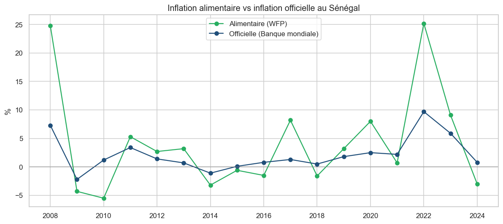
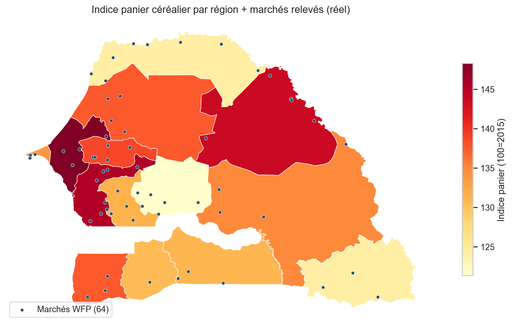

# Rapport analytique — Prix des céréales & inflation alimentaire au Sénégal (2007–2026)

*Données réelles : WFP (prix de marché) & Banque mondiale (macro).*

## 1. Données & méthode
- **64 marchés**, **14 régions**, relevés mensuels `actual` / détail, en FCFA/kg,
  pour 12 céréales et légumineuses (riz importé/local, mil, sorgho, maïs, niébé,
  arachide…). Période fiable retenue : **2007–2026**.
- Nettoyage : filtres qualité, libellés FR, **lissage des valeurs aberrantes**
  (médiane glissante / MAD), agrégation par **médiane** entre marchés.
- **Indice du panier céréalier** (base 100 = 2015), pondéré selon le régime
  alimentaire (riz importé 40 %, mil 25 %, maïs 15 %, riz local 10 %, sorgho 10 %).
- Macro Banque mondiale (API) : inflation, IPC, PIB/hab., production alimentaire.

## 2. Principaux résultats
- **Deux chocs majeurs** : la **crise alimentaire de 2008** (+25 % sur les céréales,
  contre +7 % d'inflation officielle) et le **choc de 2022** (prix mondiaux, guerre
  en Ukraine).
- **Cohérence forte** : corrélation **0,91** entre l'inflation alimentaire (WFP) et
  l'inflation officielle (Banque mondiale) — l'alimentaire amplifie le cycle.
- **Denrées les plus inflationnistes** sur la période : **riz local (+108 %)**,
  maïs importé (+83 %), mil (+79 %).
- **Saisonnalité** marquée des céréales locales (mil, sorgho) : pic en période de
  **soudure** (avant les récoltes).
- **Disparités régionales** : Dakar et l'ouest plus chers (denrées importées) ;
  visibles sur la carte des 64 marchés.

## 3. Prévision
Comparaison Marche aléatoire / Régression / SARIMA (/ Prophet). Sur le prix réel
du riz importé, la **régression (tendance + saisonnalité)** obtient la meilleure
erreur de test (**MAPE ≈ 5,3 %**), SARIMA servant de modèle saisonnier de référence
avec intervalles de confiance. ⚠️ Prévisions sensibles aux chocs exogènes
(prix mondiaux, climat/récoltes, subventions) — à interpréter avec prudence.

## 4. Recommandations
- **Surveiller le riz importé** (forte dépendance aux importations et au prix
  mondial) et constituer des **stocks tampons** avant la soudure.
- **Cibler les régions** les plus exposées pour les filets sociaux.
- Soutenir la **production locale** (mil, maïs) pour réduire la volatilité importée.
